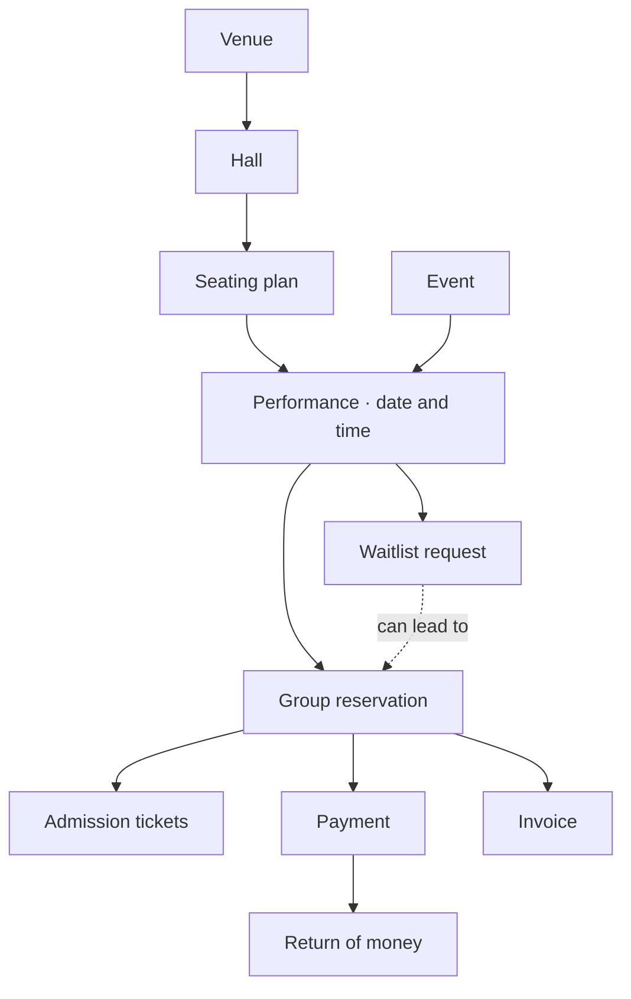
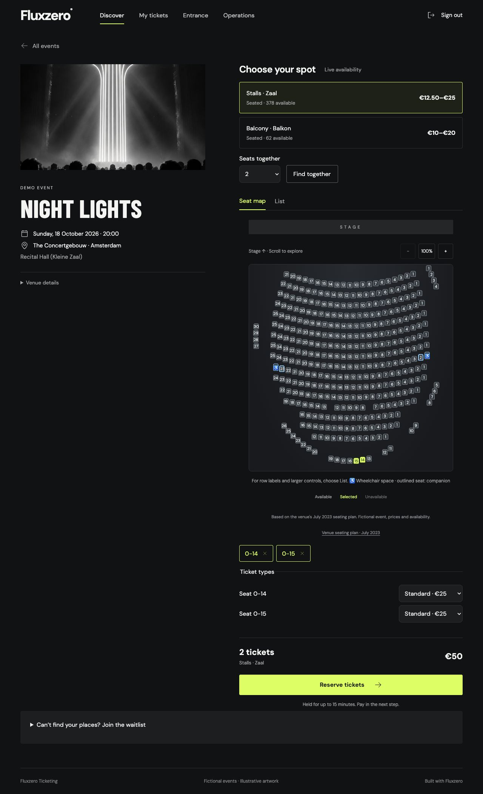
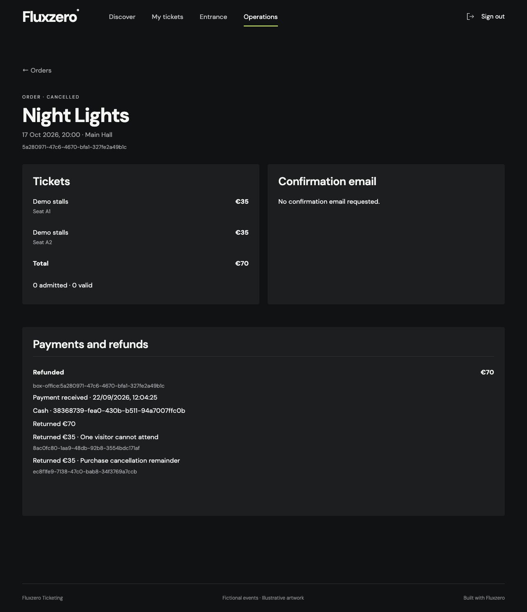

# Fluxzero Ticketing

A working ticketing example built with **version 2 of the Fluxzero Java SDK**. It includes
seat selection, temporary group reservations, payments, refunds, ticket delivery and entrance
checks, with a customer UI and an organizer workspace.

The example shows how to build these features around their product rules, including what
happens when many people book at once. You and your coding agent describe the behavior;
Fluxzero provides the storage, message handling, scheduling and coordination of concurrent
changes. Application code connects those capabilities to the ticketing rules.

You can use this repository to understand the approach, try the flows and build on them.
You do not need to read Java to follow the product model below.


## The product model

A venue contains halls. Each hall has a seating plan. An event can have several performances,
each with its own date, place and availability. Visitors reserve places for one performance;
a successful purchase gives them tickets. Payments, returns and invoices keep their own history.

These are Fluxzero **Models**: business objects with their own identity and lifecycle.
Their relationships form the **model graph**. The graph below reflects the application's
model, so both a builder and an agent can use it to work out where a feature belongs.



Read the solid arrows as “belongs under”; the dotted arrow connects a waitlist request to its
offer. This is the main path through the product; the [full graph](docs/model.md) includes
inventory, staff access and the other supporting models.

These distinctions matter in everyday situations. If a payment arrives after a reservation
has expired, the money is recorded and a refund is required. The expired reservation does not
come back to life, and the next buyer keeps their seats.

## What is built

| Feature | Behavior in this app |
| --- | --- |
| Venues and performances | Multiple venues, halls and seating plans; performances with dates, prices and sales windows. |
| Seat and section selection | Numbered seats or general admission, adjacent-seat suggestions, ticket types and wheelchair/companion places. |
| Reservations | Hold a whole group for up to fifteen minutes. Reserve all requested places together, or reject the request. Expiry and cancellation release availability. |
| Payments and refunds | Stripe checkout, recorded box-office receipts, partial returns and cancellation refunds. Payment history remains separate from reservation validity. |
| Tickets and admission | Downloadable PDF tickets, QR codes, accepted transfers and online check-in that refuses a second admission. |
| Organizer operations | Schedule performances, find orders, block production places, make box-office sales, offer waitlist places and settle cancellations. |
| Delivery and wallets | Confirmation emails captured in a local inbox, plus Apple Wallet pass and Google Wallet save-link generation. Real phone installation needs issuer configuration. |
| Invoicing | Invoices and full credit notes with their own history in the core. Billing screens and invoice delivery are not implemented. |

## How the rules become an application

Take a request such as: **“Reserve these three seats for fifteen minutes. If one is no longer
available, reserve none of them.”** In the code, that is a `ReserveTickets` command. It checks
the sales rules and describes the reservation and inventory changes that must happen together.
Fluxzero commits those changes as one operation and detects competing changes before accepting
them. The application does not need its own database transaction or locking implementation.

The same approach carries through the rest of the app. An expiry command releases a hold;
a payment confirmation records money received and checks whether tickets may still be issued;
a check-in command records admission only when the ticket is valid and unused. Fluxzero supplies
persistent Models, their relationships and history, message delivery and scheduled commands.
The application supplies the decisions: how long a hold lasts, who may cancel it and when money
must be returned.

To add a feature, start with its business concepts, commands and rules, then ask your agent
to demonstrate them through scenarios. For example: reserve a group, advance time past
the deadline, let another customer book, then confirm the first payment. The tests use the
same application handlers through Fluxzero's `TestFixture`, including controlled payment-provider
responses.

## Concurrent bookings

Many customers can request the same places at once. A displayed availability count is only a
preview; the booking decision must check the current inventory. A group must be accepted in
full or refused, and a late payment must not reclaim places already allocated to someone else.

Model boundaries keep that decision small. A booking changes one reservation and the inventory
for its selected seats or sections. It does not read or rewrite all earlier reservations for
the performance. Different seats have separate inventory; buyers of standing tickets share
the capacity of their section. Fluxzero coordinates the competing changes, while the application
expresses the capacity and ownership rules.

## What has been demonstrated

The automated scenarios exercise the app's actual booking and payment rules. They deliberately
include things going wrong, as well as successful purchases.

| Situation | What the scenarios check |
| --- | --- |
| Several buyers want the same seat | Exactly one reservation succeeds; a group never gets only part of its requested places. |
| Different ticket types or sales channels compete | Online bookings, box-office sales and production blocks use the same stock. |
| A reservation expires or is cancelled | Its places become available again. A late payment cannot take them back from a new buyer. |
| A customer returns one ticket, then cancels the rest | Only the remaining amount is returned; the original payment and both refunds remain visible. |
| A ticket changes hands | The recipient must accept. The previous QR code and codes inside saved wallet passes no longer grant entry. |
| A ticket is scanned twice | The second admission is refused. |
| The payment provider is slow or temporarily fails | Bookings can complete while provider responses wait; retries retain the same operation identity. |
| Sales history grows | Creating a new reservation does not read or rewrite the full history of earlier bookings. |

The combined pressure scenario starts **64 simultaneous requests for two places each**, against
**80 available places**. It checks exactly **40 accepted groups**, then cancels ten and reserves
those twenty places again while the payment provider is still paused. After the provider resumes,
ten temporary failures are retried, the cancelled purchases are refunded and the replacement
reservations remain intact.

This checks the business outcomes under a short burst; it is not a production throughput
measurement. A larger test against the development runtime sends up to 2,048 requests with
256 concurrent callers. These scenarios check reservation outcomes and inventory under contention;
production capacity still depends on the deployment and its traffic pattern.

The [load-test explanation](docs/load-testing.md) describes both tests and their limits.
The [verification guide](docs/development.md#verification) maps the other behaviors to their tests.

## Try it locally

Install the tools through [Fluxzero Get Started](https://fluxzero.io/get-started/), then open
this repository in your coding agent. You can ask:

> Start this ticketing app with the Fluxzero development environment. Help me reserve two
> seats together, then show me the organizer workspace as demo-organizer. Explain which
> rules protect those seats while someone is paying.

<details>
<summary>Terminal setup for developers</summary>

Use Java 25, a Node.js version supported by the frontend dependencies, and Mailpit on your PATH
(`brew install mailpit` on macOS). Run from this repository:

```sh
fz dev
```

Open the URL printed by the environment. It starts the app, local sign-in and Mailpit,
seeds fictional performances, and manages reloads and affected tests. Devboard shows the
app preview, recorded progress and test results. The local runtime is ephemeral; a restart
can start a fresh demo. See [development](docs/development.md) for details.

</details>

No payment or email account is needed for the default local profile. Sign in with a local demo
username to reserve places. Use **`demo-organizer`** for **Operations** and **Entrance**.
Local sign-in is for development only.

### 1. Choose real places

Open **Night Lights** in the Concertgebouw's **Recital Hall**. Choose stalls or balcony, use
**Find together**, or switch to the row list. Select a ticket type for each visitor and reserve
the group. You can watch the hold expire and see the places become available again.



This layout contains **440 places**, based on the venue's July 2023 plan, including wheelchair
and companion places. Other simplified layouts are explicitly labelled demonstrations.
The venues are real; events, prices, availability and artwork are illustrative.
[Venue sources](docs/demo-data.md) and [seating details](docs/seating.md).

If suitable places are unavailable, join the waitlist with a section and group size. Staff can
offer a complete group; check **My tickets** to review and pay before the offer expires.
Offers are chosen by staff. Automatic queue order and offer notifications are not implemented.

### 2. Sell a ticket and admit its owner

As **demo-organizer**, open a performance in **Operations** and make a box-office sale.
Record a demo cash receipt to complete a purchase without a Stripe account. This records a
staff acknowledgement; it does not move money. Open the issued ticket, download its PDF,
and use **Entrance** to check its code. Try the same code twice.

For online card checkout, enable the separate [Stripe sandbox profile](docs/integrations.md#stripe-sandbox-development-profile)
with sandbox credentials. The default profile lets customers reserve, but cannot complete an
online payment without that configuration.

### 3. Change plans

Transfer a ticket to a customer who has signed in once. They accept it in **My tickets**; the
old code stops working. Or open an order as its manager and return an unused ticket. Cancelling
the rest of that order returns only the remaining amount.



## Extend it with your agent

Start with the behavior you want to add. For example:

- “Add doors-open time and age guidance to each performance, and show them before booking.”
- “Let an organizer export an admission list for a performance they manage.”
- “Design a rescheduling flow that lets customers keep their tickets or request a refund.”

These extensions are not implemented yet. Ask your agent to identify the affected Models,
write the rules and demonstrate them with scenarios before adding the screens. Include what
happens when two people act at once, time runs out or an external service responds late.

## Local defaults and optional setup

| Area | Included in the example | Requires additional setup or work |
| --- | --- | --- |
| Payments | Provider-independent payment history, Stripe checkout/refund workflows and controlled-response tests | Sandbox credentials to try checkout; merchant setup and qualification for live money |
| Email | Confirmation messages captured locally in Mailpit | An outgoing provider for real email delivery |
| Wallets | Apple pass and Google save-link generation, signing and credential-revocation tests | Issuer credentials and physical-device qualification; live updates to installed passes |
| Entrance | Online check-in and staff permissions | Camera scanning and offline admission policies |
| Invoicing | Independent invoices and full credit notes in the core | Billing UI, delivery, partial credits and jurisdiction-specific tax/numbering |
| Deployment | Local development and recovery scenarios | Production sizing, sustained traffic tests, tenant isolation and operational setup |

Wallet buttons appear only with issuer configuration. See [delivery and wallets](docs/delivery.md)
for the distinction between locally verified artifacts and a pass installed on a real phone.
The [capability inventory](docs/product-capabilities.md) describes further extensions such as
rescheduling, promotions and high-demand sale queues.

<details>
<summary>For developers: follow the behavior into the code</summary>

The domain uses Fluxzero Models, explicit commands and atomic changes across a bounded set of
models. The graph expresses relationships without turning the entire performance history into
one transaction. Stripe process state and provider attempts stay outside it in `@Stateful`
handlers. Specific local commands and queries make external calls through Fluxzero's webrequest API.
Tests use the real SDK and domain through `TestFixture`.

Start with [`ReserveTickets`](src/main/java/io/fluxzero/ticketing/booking/api/ReserveTickets.java),
[`RecordPaymentSuccess`](src/main/java/io/fluxzero/ticketing/payment/api/RecordPaymentSuccess.java)
and [`OfferWaitlistPlaces`](src/main/java/io/fluxzero/ticketing/waitlist/api/OfferWaitlistPlaces.java).

- [Model graph and transaction boundaries](docs/model.md)
- [Product rules and scenarios](docs/product-rules.md)
- [Domain packages](docs/packages.md)
- [Browser flows and organizer operations](docs/ui.md)
- [Stripe integration and recovery](docs/integrations.md)
- [Development and verification](docs/development.md)

</details>
