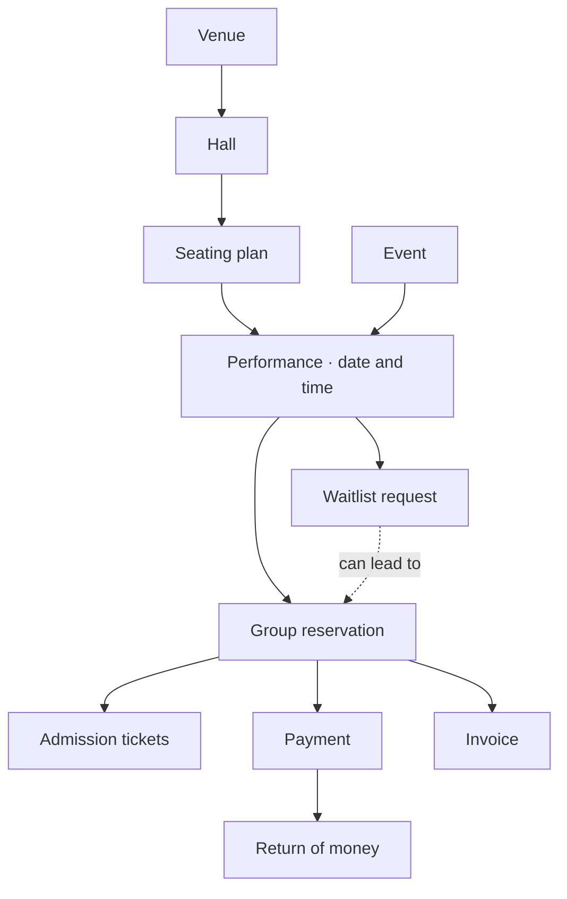

# Fluxzero Ticketing

**A complete evening out, from choosing seats to checking tickets at the door.**

This sample shows how a product built with **Fluxzero 2.0** can handle the things that make
real ticketing interesting: groups booking together, the last available seat, a slow payment,
a change of plans and a busy entrance. It includes a working customer app and organizer workspace.

You can explore it with your coding agent, even if you do not write code yourself. Start with
the product below, then [try it locally](#try-it-locally).


## How the product fits together

A venue contains halls. Each hall has a seating plan. An event can have several performances,
each with its own date, place and availability. Visitors reserve places for one performance;
a successful purchase gives them tickets. Payments, returns and invoices keep their own history.

This connected picture is called the **model graph**. It describes the actual business objects
in the app, so a new feature has a clear place to belong.



Read the solid arrows as “belongs under”; the dotted arrow connects a waitlist request to its
offer. This is the main path through the product; the [full graph](docs/model.md) includes
inventory, staff access and the other supporting models.

These distinctions matter in everyday situations. If a payment arrives after a reservation
has expired, the money is recorded and a refund is required. The expired reservation does not
come back to life, and the next buyer keeps their seats.

## What you can do

| As a visitor | As an organizer |
| --- | --- |
| Discover shows by place and date | Schedule performances and set sales windows |
| Choose numbered seats or a standing section | Sell at the box office from the same available stock |
| Find seats together and choose ticket types | Hold places for production and release them later |
| Reserve a whole group for up to fifteen minutes | Offer suitable places to people on the waitlist |
| Pay online when Stripe is configured | Find orders and return selected unused tickets |
| Download PDF tickets and open their QR codes | Cancel a performance and follow the settlement |
| Transfer a ticket for another customer to accept | Grant staff access and check tickets at the entrance |

Confirmation email is captured in a local inbox. Apple and Google Wallet integrations are
included; installing passes on a real phone requires your own issuer configuration. Invoices
and full credit notes have their own lifecycle in the core; an invoice editor and delivery
flow are not yet part of the UI.

## What has been demonstrated

The automated scenarios exercise the app's actual booking and payment rules. They deliberately
include things going wrong, as well as successful purchases.

| Situation | What the scenarios check |
| --- | --- |
| Several buyers want the same seat | Exactly one reservation succeeds; a group never gets only part of its requested places. |
| Different ticket types or sales channels compete | Online bookings, box-office sales and production blocks use the same stock. |
| A reservation expires or is cancelled | Its places become available again. A late payment cannot take them back from a new buyer. |
| A customer returns one ticket, then cancels the rest | Only the remaining amount is returned; the original payment and both refunds remain visible. |
| A ticket changes hands | The recipient must accept. The previous QR code and codes inside saved wallet passes no longer grant entry. |
| A ticket is scanned twice | The second admission is refused. |
| The payment provider is slow or temporarily fails | Bookings can complete while provider responses wait; retries retain the same operation identity. |
| Sales history grows | Creating a new reservation does not read or rewrite the full history of earlier bookings. |

The combined pressure scenario starts **64 simultaneous requests for two places each**, against
**80 available places**. It checks exactly **40 accepted groups**, then cancels ten and reserves
those twenty places again while the payment provider is still paused. After the provider resumes,
ten temporary failures are retried, the cancelled purchases are refunded and the replacement
reservations remain intact.

That demonstrates correct outcomes under a short burst of concurrent demand. It does **not**
establish how many customers a production deployment can serve per second. The
[load-test explanation](docs/load-testing.md) describes the measurements and their limits;
the [verification guide](docs/development.md#verification) maps other behaviors to their tests.

## Try it locally

Install the tools through [Fluxzero Get Started](https://fluxzero.io/get-started/), then open
this repository in your coding agent. You can ask:

> Start this ticketing app with the Fluxzero development environment. Help me reserve two
> seats together, then show me the organizer workspace as demo-organizer. Explain which
> rules protect those seats while someone is paying.

**Temporary setup step:** this branch uses an unpublished Fluxzero SDK build,
`2.0.0-119060b1101-SNAPSHOT`. Your agent must follow the
[SDK prerequisite](docs/development.md#local-sdk-prerequisite-for-this-development-branch)
first. A published SDK containing those fixes must replace it before this example is published.

<details>
<summary>Terminal setup for developers</summary>

Use Java 25, a Node.js version supported by the frontend dependencies, and Mailpit on your PATH
(`brew install mailpit` on macOS). After installing the SDK prerequisite, run from this repository:

```sh
fz dev
```

Open the URL printed by the environment. It starts the app, local sign-in and Mailpit,
seeds fictional performances, and manages reloads and affected tests. Devboard shows the
app preview, recorded progress and test results. The local runtime is ephemeral; a restart
can start a fresh demo. See [development](docs/development.md) for details.

</details>

No payment or email account is needed for the default local profile. Sign in with a local demo
username to reserve places. Use **`demo-organizer`** for **Operations** and **Entrance**.
Local sign-in is for development only.

### 1. Choose real places

Open **Night Lights** in the Concertgebouw's **Recital Hall**. Choose stalls or balcony, use
**Find together**, or switch to the row list. Select a ticket type for each visitor and reserve
the group. You can watch the hold expire and see the places become available again.


This layout contains **440 places**, based on the venue's July 2023 plan, including wheelchair
and companion places. Other simplified layouts are explicitly labelled demonstrations.
The venues are real; events, prices, availability and artwork are illustrative.
[Venue sources](docs/demo-data.md) and [seating details](docs/seating.md).

If suitable places are unavailable, join the waitlist with a section and group size. Staff can
offer a complete group; check **My tickets** to review and pay before the offer expires.
Offers are chosen by staff. Automatic queue order and offer notifications are not implemented.

### 2. Sell a ticket and admit its owner

As **demo-organizer**, open a performance in **Operations** and make a box-office sale.
Record a demo cash receipt to complete a purchase without a Stripe account. This records a
staff acknowledgement; it does not move money. Open the issued ticket, download its PDF,
and use **Entrance** to check its code. Try the same code twice.

For online card checkout, enable the separate [Stripe sandbox profile](docs/integrations.md#stripe-sandbox-development-profile)
with sandbox credentials. The default profile lets customers reserve, but cannot complete an
online payment without that configuration.

### 3. Change plans

Transfer a ticket to a customer who has signed in once. They accept it in **My tickets**; the
old code stops working. Or open an order as its manager and return an unused ticket. Cancelling
the rest of that order returns only the remaining amount.


## Make it your own

Use the app as a starting point for a conversation with your agent. For example:

- “Add doors-open time and age guidance to each performance, and show them before booking.”
- “Let an organizer export an admission list for a performance they manage.”
- “Design a rescheduling flow that lets customers keep their tickets or request a refund.”

These are ideas for extensions, not features already delivered. Ask your agent to explain the
product rule, add it to the appropriate part of the graph and demonstrate both the happy path
and what happens when the action cannot be completed.

## Integration and production boundaries

| Area | Included in the example | Requires additional setup or work |
| --- | --- | --- |
| Payments | Provider-independent payment history, Stripe checkout/refund workflows and controlled-response tests | Sandbox credentials to try checkout; merchant setup and qualification for live money |
| Email | Confirmation messages captured locally in Mailpit | An outgoing provider for real email delivery |
| Wallets | Apple pass and Google save-link generation, signing and credential-revocation tests | Issuer credentials and physical-device qualification; live updates to installed passes |
| Entrance | Online check-in and staff permissions | Camera scanning and offline admission policies |
| Invoicing | Independent invoices and full credit notes in the core | Billing UI, delivery, partial credits and jurisdiction-specific tax/numbering |
| Deployment | Local development and recovery scenarios | Production sizing, sustained traffic tests, tenant isolation and operational setup |

Wallet buttons appear only with issuer configuration. See [delivery and wallets](docs/delivery.md)
for the distinction between locally verified artifacts and a pass installed on a real phone.
The [capability inventory](docs/product-capabilities.md) describes further extensions such as
rescheduling, promotions and high-demand sale queues.

<details>
<summary>For developers: follow the behavior into the code</summary>

The domain uses Fluxzero Models, explicit commands and atomic changes across a bounded set of
models. The graph expresses relationships without turning the entire performance history into
one transaction. Stripe process state and provider attempts stay outside it in `@Stateful`
handlers. Specific local commands and queries make external calls through Fluxzero's webrequest API.
Tests use the real SDK and domain through `TestFixture`.

Start with [`ReserveTickets`](src/main/java/io/fluxzero/ticketing/booking/api/ReserveTickets.java),
[`RecordPaymentSuccess`](src/main/java/io/fluxzero/ticketing/payment/api/RecordPaymentSuccess.java)
and [`OfferWaitlistPlaces`](src/main/java/io/fluxzero/ticketing/waitlist/api/OfferWaitlistPlaces.java).

- [Model graph and transaction boundaries](docs/model.md)
- [Product rules and scenarios](docs/product-rules.md)
- [Domain packages](docs/packages.md)
- [Browser flows and organizer operations](docs/ui.md)
- [Stripe integration and recovery](docs/integrations.md)
- [Development and verification](docs/development.md)

</details>
