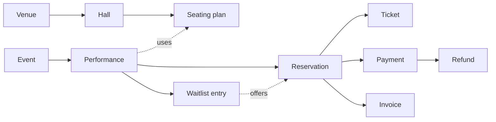

# Fluxzero Ticketing

From finding a show to walking through the doors. A working ticketing app that shows what you
can build with **Fluxzero 2.0**: real seat selection, shared inventory, payments, tickets and
organizer tools, with the business rules behind them.


## Try it locally

Install the tools through [Fluxzero Get Started](https://fluxzero.io/get-started/), then open
this repository in your coding agent. You can ask:

> Start this ticketing app with the Fluxzero development environment. Help me try the customer
> journey, then sign in as demo-organizer to explore the organizer tools.

**This branch still requires a local SDK build.** It pins `2.0.0-119060b1101-SNAPSHOT`, which
is not published. Follow the [SDK prerequisite](docs/development.md#local-sdk-prerequisite-for-this-development-branch)
before starting. A released SDK containing these fixes must replace this pin before publication.

<details>
<summary>Start from the terminal</summary>

Use Java 25, a current Node.js version supported by Vite, and Mailpit on your PATH
(`brew install mailpit` on macOS). After installing the SDK prerequisite, run from this repository:

```sh
fz dev
```

Open the local URL printed by the environment. It starts the runtime, frontend, backend,
local sign-in and Mailpit, seeds fictional performances, and manages reloads and affected tests.
The local runtime is ephemeral; a restart can start a fresh demo. See
[development and verification](docs/development.md) for configuration and test boundaries.

</details>

No payment or email account is needed to explore the default local profile. Sign in with a
local demo username to reserve seats. Use **`demo-organizer`** to unlock **Operations** and
**Entrance**. The local sign-in service is for development only.

## Three things to try

### Find your places

Open **Night Lights** in the Concertgebouw's **Recital Hall**. Pick the stalls or balcony,
find adjacent seats, or switch to the row list. Choose a ticket type for each visitor and
reserve the group together. The hold lasts up to fifteen minutes; an expired hold releases
its places. Standing sections use the same checkout with a quantity instead of seat numbers.


The Recital Hall layout contains **440 places**, based on the venue's July 2023 seating plan,
including wheelchair and companion places. Other simplified layouts are labelled demonstrations.
Venues are real; performances, prices, availability and artwork are illustrative.
[Venue sources and layout details](docs/demo-data.md).

Can't find suitable places? Join the waitlist with a section and group size. An organizer can
offer a complete group through an ordinary expiring reservation. Review the offer in **My tickets**.
Offers are selected by staff; the sample does not promise automatic FIFO allocation or send
waitlist notifications.

### Run the show

In **Operations**, open a performance to manage sales windows, protect production allocations,
offer waitlist places and make box-office sales from the same stock as online sales.
For an account-free local purchase, record a demo cash receipt in the box office; this records
an acknowledgement and does not move money. Open the issued ticket, download its PDF, then
use **Entrance** to check its code. A second scan is rejected.

Organizers can also schedule performances, find orders, grant performance-specific staff access
and cancel a performance. Customer ownership and staff permissions are enforced in the backend.

### Change plans without losing the story

Transfer a ticket to another signed-in customer and let them accept it. The old admission code
stops working. Or return selected unused tickets from the organizer's order view. A later
cancellation refunds only the remaining amount, preserving the original payment and each return.


## What runs here

| Capability | Local example | Optional external setup |
| --- | --- | --- |
| Discovery, reservations and operations | Seeded shows, seat maps, shared stock, waitlists, production blocks and box office | Your own catalogue and deployment |
| Online payments and refunds | Provider-independent core; Stripe behavior tested with controlled responses | [Stripe sandbox profile](docs/integrations.md#stripe-sandbox-development-profile) and sandbox credentials |
| Ticket delivery | Owned QR tickets, PDFs and confirmation messages captured locally in Mailpit | An outgoing email provider for real delivery |
| Apple and Google Wallet | Signed artifact, ownership and credential-revocation tests | Apple Pass Type certificate and Google issuer credentials; physical-device qualification remains separate |
| Admission | Online check-in with staff permissions and duplicate-entry protection | Camera/offline scanning and its conflict policy are extensions |

Wallet buttons appear only when issuer configuration is available. Previously saved wallet
codes are revoked on transfer; live updates to installed passes are not implemented.
[Delivery, mail and wallet setup](docs/delivery.md).

## Why this is a Fluxzero example

The code starts with business actions: **reserve tickets**, **record a payment**, **offer places**,
**return tickets**. Fluxzero connects those actions to models with their own identity and history.
A reservation, payment and invoice remain different facts: money arriving late cannot bring
an expired reservation back to life or take seats away from another visitor.



This is a simplified relationship map; the [full model graph](docs/model.md) explains ownership,
references and transaction boundaries. A group reservation either gets all its places or none.
Inventory changes stay bounded by the group, rather than rewriting a performance's entire sales
history. Stripe's process state and provider attempts live outside this graph in `@Stateful`
handlers. Specific local commands and queries make external calls through Fluxzero's webrequest API.

Tests exercise the actual models through `TestFixture`, including conflicting bookings, expired
holds, delayed payments, refunds and recovery. The [peak-sales scenario](docs/load-testing.md)
adds concurrent group demand while the payment provider is paused, then injects temporary failures
and checks recovery without overselling. It qualifies local behavior under pressure; it is not a
production throughput claim.

## Explore the implementation

- [Product rules and example scenarios](docs/product-rules.md)
- [Model graph and transaction boundaries](docs/model.md)
- [Domain packages and source layout](docs/packages.md)
- [Browser flows and organizer operations](docs/ui.md)
- [Source-backed seating configuration](docs/seating.md)
- [Stripe integration and recovery](docs/integrations.md)
- [Development, verification and SDK prerequisite](docs/development.md)
- [Further product possibilities and current gaps](docs/product-capabilities.md)

Start in the code with [`ReserveTickets`](src/main/java/io/fluxzero/ticketing/booking/api/ReserveTickets.java),
[`RecordPaymentSuccess`](src/main/java/io/fluxzero/ticketing/payment/api/RecordPaymentSuccess.java)
and [`OfferWaitlistPlaces`](src/main/java/io/fluxzero/ticketing/waitlist/api/OfferWaitlistPlaces.java).

This is a reference app, with deliberate extension points for production use: tenant isolation,
merchant and issuer qualification, tax and invoice delivery, rescheduling, abuse controls and
operational deployment. No GitHub publication or deployment is configured.
