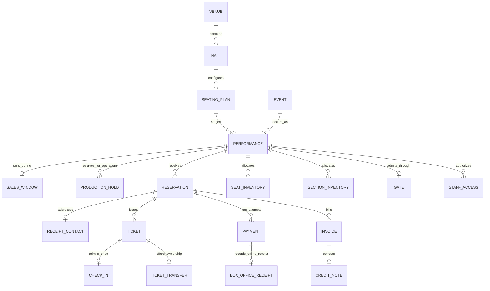

# Model graph

Every box is an independent Fluxzero `@Model` with typed identity. Business records retain
event-sourced history. Inventory Models retain current document state; their purpose is
bounded allocation, while reservation and financial events retain the purchase history. Every drawn edge is an owning child-side `@Parent` relation with an explicit
composition path and the default cascade policy. Independent identity and history do not
require a child to remain active after its parent is deleted.

| Model | Identity and purpose | Lifecycle |
| --- | --- | --- |
| Venue | `VenueId`, sourced name and address | Registered independently of programmes |
| Hall | `HallId`, belongs to a venue | Independently registered room |
| SeatingPlan | `SeatingPlanId`, hall + immutable configuration revision | Registered independently; changed geometry/capacity requires a new ID |
| Event | `EventId`, programme title and description | Shared by multiple performances |
| Performance | `PerformanceId`, event + seating plan + instant + time zone | Bookable until start; may be cancelled |
| SalesWindow | Performance-scoped identity, opening and closing instants | Independently revised; gates new holds without invalidating existing ones |
| ProductionHold | `ProductionHoldId`, reason and bounded positions | Explicit block → release; history retained |
| SeatInventory | `(performance, section, seat)` | One current reservation or production allocation, deadline and sold flag |
| SectionInventory | `(performance, section)` | Sold and production-blocked counts and active deadline counts; at most 900 second buckets |
| Reservation | `ReservationId`, authenticated customer and complete priced selection | Held → confirmed, expired or cancelled; confirmed → cancelled |
| Ticket | `TicketId`, reservation, explicit performance, customer and admission | Issued only on accepted payment; valid → void |
| Payment | `PaymentId`, reservation, expected and actual amounts | Pending → failed or captured; captured → refund required → refunded |
| Invoice | `InvoiceId`, reservation and paying attempt, frozen lines and total | Draft → issued or void; issued → credited |
| CreditNote | `CreditNoteId`, original invoice, full amount and reason | Issued correction with its own retained history |

`Ticket.performanceId` is an explicit typed reference. Its graph path to the performance
already runs through the reservation, so an extra parent edge would duplicate the same
placement. `Invoice.paymentId` identifies the paying attempt without making that attempt
own the invoice.

## Deletion, history and cancellation

Logical deletion makes the current Model empty and recursively does the same for its owned
children in one atomic commit. Their event-sourced history remains available, including the
last financial facts through `previous()`. For example, deleting a venue also logically
deletes its halls, seating plans, performances and their reservation, ticket, payment, billing and adapter
records. Deleting a reservation reaches its tickets, payments, invoices and credit notes. Cascade follows descendants, not parents or siblings.

A performance has two owning parents: its programme and its seating plan. Deleting **either** logically
deletes that performance and its descendants. Deleting a hall does not delete the programme
or performances hosted in other halls.
Plain references such as `Ticket.performanceId` and `Invoice.paymentId` add no deletion edge.
`deleteOnParentDeletion = false` would be appropriate for a relation whose child must remain
an active, independently addressable record after that parent disappears; none of these
ownership edges needs that exception merely to preserve history.

Physical deletion deliberately erases selected Model streams, documents, snapshots and cache
state. The SDK treats descendant erasure separately: inspect `planDeletion(id, DESCENDANTS)`
and execute that exact plan with `deleteModel(plan)`. Globally published events remain outside
this Model-stream erasure boundary, so this is not a claim that all copies or all audit events
disappear.

Cancellation is a business transition: `CancelReservation` and `CancelPerformance` keep
current records, void tickets and record refund obligations. Invoice crediting and completed
repayment remain separate actions. Neither logical nor physical deletion executes a refund.
There are no production deletion commands or erasure endpoints in this phase; fixture-only
commands exercise the declared lifecycle and history behavior. A future deletion action must
first handle any outstanding commercial work rather than use deletion as cancellation.

## Selection identity

A hall has one or more independent `SeatingPlan` Models. `HallDetails` describes only the
room; `SeatingPlanDetails` holds a configuration name, version label, immutable `Section`
and `Seat` values and optional source provenance. Sections have stable keys within a plan; seats have stable keys within a section plus readable row and number.
Optional section-local coordinates and a standard/wheelchair/companion kind describe the
physical position. `SeatingPlanDetails.source` records the source title, URL, revision and check date;
see the [source-backed configuration](seating.md).
Section and seat values share the plan lifecycle. `RegisterSeatingPlan` creates a complete
immutable revision under an existing hall; an existing plan identity cannot be overwritten,
even before use. `SchedulePerformance` explicitly chooses a `SeatingPlanId` and prices every
section of that plan. It cannot replace an existing performance or rebind its plan. A selection is consequently unambiguous as
`(performanceId, sectionId, seatId)`; general admission uses `seatId = null`.

Each `Selection` is one admission. Repeating a general admission selection requests several
admissions; repeating a numbered seat is illegal. A reservation freezes the individual
prices and total. Tickets copy those admissions rather than inventing physical places for
general admission. Their deterministic IDs are derived from reservation ID and line number.

A changed configuration is registered as a new plan ID with an explicit version label.
Existing performances continue to reference their original plan; they do not follow a
mutable default or copy the entire plan into every performance. Reads load that immutable
Model by ID and participate in the SDK transaction readset. No sibling-plan scan or
shared mutable hall counter is added to booking. Reusing the same plan across performances
never shares their inventory. An operator editor, retirement policy and collision checks
remain separate future work.

## Atomic business decisions

`ReserveTickets` validates the selected immutable plan, performance gate and current `SalesWindow`, then returns a normalized
`ReservationHeld` plus at most twelve inventory changes. Fluxzero commits the entire ordered
set atomically. No retained reservation collection or search result decides the sale. A failed
last selection rolls back every earlier selection. Different seats have independent inventory
Models; free admission serializes only at its own section counter.

Seat ownership expires at the stored deadline. Section inventory counts sold admissions plus
holds whose deadline is still in the future. Deadlines have second precision, rounded down
from the fifteen-minute/start-time cap. This bounds the active deadline map to 900 entries;
expired entries are removed on the next stock change and never contribute to availability.
Time-based release therefore does not depend on timer delivery. Counters change in the same
transaction as the reservation; they are not eventually consistent projections.

`RecordPaymentSuccess` checks the current reservation and performance gate at processing time.
An accepted capture updates payment, reservation, tickets and inventory in one commit. If a
replacement allocation commits after expiry, the shared inventory conflict forces reevaluation;
the late capture becomes a refund obligation. A historical provider timestamp cannot revive it.

Normalized events have automatic command handling disabled. Customers cannot submit an
acceptance decision or an inventory delta as a standalone command. Current events reconstruct
business history; no historical schema migration is included. See the storage boundary below.

`CancelReservation` releases at most twelve selections, voids at most twelve tickets and marks
its one paying attempt for refund. It does not scan the history of failed payment attempts.
`CancelPerformance` commits cancellation state `SETTLING`. That immediately blocks further
booking and accepted capture. `Purchase.performanceCancelled` exposes the gate even before
individual ticket statuses have been settled; future admission checks must enforce it too.

`PerformanceCancellation` reacts to the committed cancellation event with an injected
`Graph<Performance>` and `previous()`. It stores a `SettlePerformanceCancellation` event.
Each delivery discovers at most 100 active reservations and commits each idempotent
`CancelPerformanceReservation` separately, then durably stores a continuation. It never loops
through every page in one handler invocation. A crash before continuation publication replays
the page; already settled reservations are excluded and stale candidates are rechecked.

The cancelled performance gate prevents new active purchases. Reservation Model commit completion
includes their public document writes, so an empty discovery page after the gate closes completes
admission settlement as `SETTLED`. This does not claim that refunds or credit notes have finished.
There is no unbounded Model transaction or all-performance reservation list.

`ReservationDeadlines` reconciles current committed intent. It installs the stable deadline
for a held reservation and removes it on terminal state. `ExpireReservation` declares its
`ReservationId` as `@Parent`, so direct or cascaded deletion also cancels the stored schedule
without an application observer. Already delivered commands still check current status and time;
a missing reservation is a no-op. Availability and payment rules check time themselves, so
scheduler delays never extend a hold.

An absent `SalesWindow` means sales are open until performance start, preserving a small useful
default for newly scheduled performances. `ConfigureSalesWindow` creates or revises the single
owned window and accepts venue-local input through the organizer endpoint. Closing sales blocks
new reservations immediately. It does not cancel an already accepted hold, whose own stored
deadline remains authoritative for checkout.

## Current financial relationships

`Payment.pendingReservation()` exposes an alias only while the attempt is `PENDING`.
`Invoice.invoicedReservation()` exposes one while the invoice is not `VOID`. Their distinct
alias prefixes prevent identity collisions, and the SDK replaces each alias set atomically with
the state transition. The commands inspect these identities through transaction-aware
`loadGraph(...)` reads, including absence. Concurrent contenders retry and re-evaluate the domain
rule; no search or historical child scan decides uniqueness. Failure/void releases the active
identity while retaining the original model and history. A late capture of an older attempt
does not remove a newer attempt's alias.

## Integration transactions

`StripePaymentProcess` and `StripeRefundProcess` use `@Stateful` execution memory outside this graph.
The payment process retains payment correlation, pending work, one refund authorization and
the identity of its latest refund attempt for exact operational lookup.
Each refund attempt has its own document, correlation and recovery status; old attempts never
accumulate inside the payment document. Verified webhooks become durable
internal events. A document observer executes committed intent through local HTTP commands
and applies provider-independent core facts, then acknowledges their durable completion.
Repeated delivery is expected; external idempotency and core duplicate checks protect it.
Neither Model cascade nor payment status silently deletes this workflow's retained intent.
See [integration recovery](integrations.md) for failure boundaries and storage compatibility.

## Storage transition

This unpublished reference app supports the current schema only. Use a fresh demo namespace
after incompatible changes; no namespace is migrated or erased automatically. Compatibility
aliases, upcasters and old-schema replay handlers are intentionally absent. Current payment,
reservation and invoice events still preserve their financial and business history.

## Ticket delivery and admission

`Gate` is an independently changed companion of a performance. `StaffAccess` is an independent, searchable grant for one subject and performance. `CheckIn` is an immutable companion of a ticket: its existence is the admission fact, so two scanners cannot both create it. `ReceiptContact` is an independently updated companion of a reservation.

Confirmation delivery is a separate `@Stateful` process outside this graph. It observes the exact reservation transition through event-bound `Graph<Reservation>.previous()`, then reconciles retained delivery intent. Mail acceptance is neither payment success nor admission. PDF and wallet adapters read owned ticket data; their signing material and provider formats never become core Models. See [delivery and admission](delivery.md).

## Organizer operations

Global `OPERATOR` identities schedule and cancel performances and administer grants. A
performance-scoped `MANAGE` grant permits sales-window changes, bounded order search and order
cancellation for that performance only; `ADMISSION` remains separate. `CancelManagedReservation`
uses the same reservation cancellation transition as customer and performance cancellation, so
inventory, tickets and refund obligations cannot diverge by entry point. Individually admitted
orders cannot be cancelled from the support desk. Whole-performance cancellation remains a
separate operator decision with its own settlement lifecycle.

Stripe observes entry into `PaymentStatus.REFUND_REQUIRED` through event-bound `Graph<Payment>`
and `previous()`. This includes a rejected late capture as well as cancellation. It starts a
stable, durable full-refund attempt only for payments already bound to a Stripe process.
Support can check a pending attempt, resume failed execution or start one new attempt after
terminal provider failure. The displayed attempt identifies the action; repeated clicks cannot
create additional attempts. Provider details stay in the integration, outside the core graph.

`SeatingPlan` and `Payment` expose searchable documents alongside their event history. The
organizer catalog directly pages events and plans; it never discovers plans by walking venue
descendants. An order-list row uses exact identities and bounded existence queries; the detail
pages payment history separately. Admission and ticket reads remain bounded by the twelve-ticket
reservation limit. `Person` is a document of the verified sign-in name and subject, used only for
display and staff selection. It grants no authority; `StaffAccess` owns the actual permissions.

## Seat links and price policies

A SeatingPlan owns immutable seat adjacency (`nextSeatId`) and companion-to-wheelchair links
(`companionFor`), both scoped to a section. These values share the plan's lifecycle. Performance
section prices and ticket-type policies share the scheduled performance's lifecycle; they are
not inventory. A Reservation freezes each admission's ticket type and price while the same
SeatInventory or SectionInventory protects all ticket types. Suggestions are advisory reads,
whereas the reservation command enforces group, accessibility and physical capacity invariants.

## Assisted sales and ownership

`Reservation.channel` distinguishes online and box-office sales. `BoxOfficeReceipt` is an independently retained companion of Payment, with receipt method, external reference and recording staff. It records an offline financial fact without introducing a payment-provider workflow into the graph.

`TicketTransfer` is a ticket-scoped Model with a versioned current invitation, sender, recipient, deadline and accepted/cancelled status. Repeated invitations retain their event history without growing a list on Ticket. Ticket itself has searchable current ownership and a monotonic credential version; purchase ownership and financial records remain unchanged. Queries page owned tickets and incoming invitations directly.
