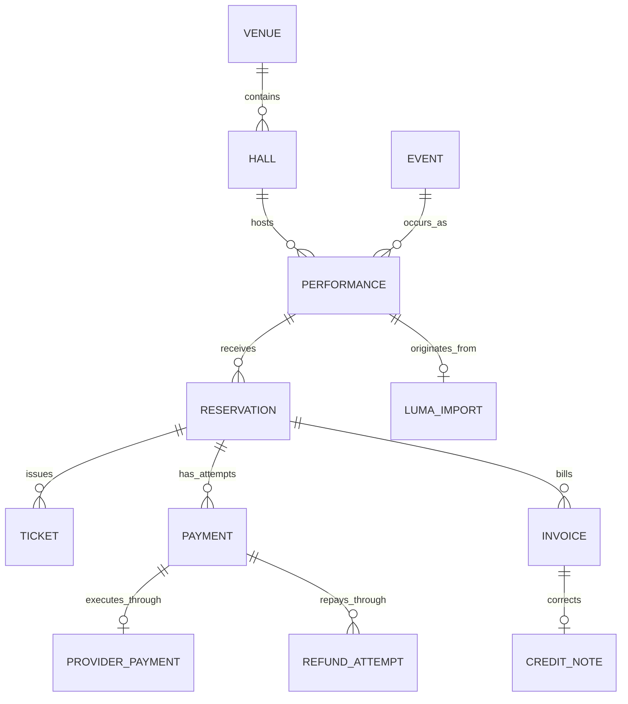

# Model graph

Every box is an independent Fluxzero `@Model` with typed identity and event-sourced
history. Every drawn edge is a child-side `@Parent` relation with an explicit composition
path and `deleteOnParentDeletion = false`. The graph expresses business relationships;
it does not give one model permission to erase another's retained history. There are
no delete commands.

| Model | Identity and purpose | Lifecycle |
| --- | --- | --- |
| Venue | `VenueId`, sourced name and address | Registered independently of programmes |
| Hall | `HallId`, belongs to a venue | Independently registered room and immutable layout |
| Event | `EventId`, programme title and description | Shared by multiple performances |
| Performance | `PerformanceId`, event + hall + instant + time zone | Bookable until start; may be cancelled |
| Reservation | `ReservationId`, authenticated customer and complete priced selection | Held → confirmed, expired or cancelled; confirmed → cancelled |
| Ticket | `TicketId`, reservation, explicit performance, customer and admission | Issued only on accepted payment; valid → void |
| Payment | `PaymentId`, reservation, expected and actual amounts | Pending → failed or captured; captured → refund required → refunded |
| Invoice | `InvoiceId`, reservation and paying attempt, frozen lines and total | Draft → issued or void; issued → credited |
| CreditNote | `CreditNoteId`, original invoice, full amount and reason | Issued correction retained independently |
| ProviderPayment | `ProviderPaymentId` derived from `PaymentId`, provider/account/environment and durable operation key | Prepared before external I/O, then bound to an external object |
| RefundAttempt | `RefundAttemptId`, payment, full captured amount, account and operation key | Requested → pending/requires action → succeeded, failed or cancelled |
| LumaImport | Calendar/event-derived `LumaImportId`, performance and source snapshot | Retained import provenance; identical reimport is a no-op |

`Ticket.performanceId` is an explicit typed reference. Its graph path to the performance
already runs through the reservation, so an extra parent edge would duplicate the same
placement. `Invoice.paymentId` identifies the paying attempt without making that attempt
own the invoice.

## Selection identity

A hall's `HallDetails` holds immutable `Section` and `Seat` values. Sections have stable
keys within a hall; seats have stable keys within a section plus readable row and number.
These values have no independently editable lifecycle in this phase. A performance freezes
that layout and section prices. A selection is consequently unambiguous as
`(performanceId, sectionId, seatId)`; general admission uses `seatId = null`.

Each `Selection` is one admission. Repeating a general admission selection requests several
admissions; repeating a numbered seat is illegal. A reservation freezes the individual
prices and total. Tickets copy those admissions rather than inventing physical places for
general admission. Their deterministic IDs are derived from reservation ID and line number.

A future independently managed or versioned seating plan should become a model with its
own lifecycle. It should not rewrite the layout of an already on-sale performance.

## Atomic business decisions

`ReserveTickets` reads `Graph<Performance>` and its reservations, including an empty child
set. The SDK validates that relationship read and the relevant model heads at commit using the
configured conflict policy. A conflicting request cannot commit a stale admission decision. A rejected group produces no
partial hold and no expiry schedule. No search index or advisory query decides the sale.

`RecordPaymentSuccess` reads payment, reservation and, for a potentially accepted capture,
the performance's current reservation set. That last dependency matters when a capture is
evaluated before expiry but its commit races a replacement hold after expiry. The conflict
restarts the decision at current processing time. One commit records the payment outcome,
updates the reservation and creates all tickets, or records money that must be refunded.

The normalized `PaymentCaptured` event carries its reservation identity explicitly so a
newly created ticket can be reconstructed before its own parent relationship exists.
Its applies have automatic command handling disabled. It cannot be used as a direct
command to supply a chosen acceptance decision or old timestamp.

`CancelReservation` changes the whole reservation, its tickets and successful payments in
one commit. `CancelPerformance` does the same across its reservations. Issued invoices
remain intact: crediting is a separate billing decision and creates a credit note.

`ReservationDeadlines` reconciles current committed intent. It installs the stable deadline
for a held reservation and removes it on terminal state. Old event redelivery therefore
does not recreate a timer for a completed purchase. Availability and payment rules check
time themselves, so delayed timer delivery never extends a hold.

## Integration transactions

`PrepareProviderPayment` records the chosen provider account and stable operation key without
changing `Payment`. One binding belongs to one payment attempt. `PrepareRefund` reads the
payment's refund-attempt graph with transactional conflict validation, so competing requests cannot create two
unresolved attempts. Both preparation commands commit before an adapter sends HTTP.

`ObserveRefund` records the attempt outcome and, on success, applies `ConfirmRefund` in the
same commit. External calls do not run inside a retrying model decision. Each adapter
interprets its protocol while reservation, payment and invoice commands retain business
ownership. See [integration recovery](integrations.md) for uncertain outcomes and late callbacks.

`AcceptLumaImport` creates the programme, performance and source mapping in one transaction.
Its deterministic source identity prevents duplicate local performances. The existing local
hall layout and operator-supplied prices define inventory; remote capacity never does.
